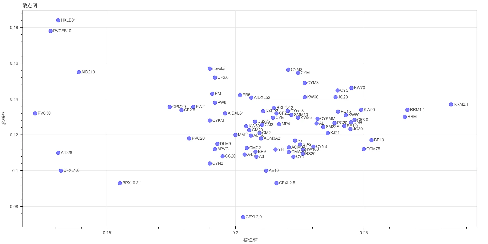
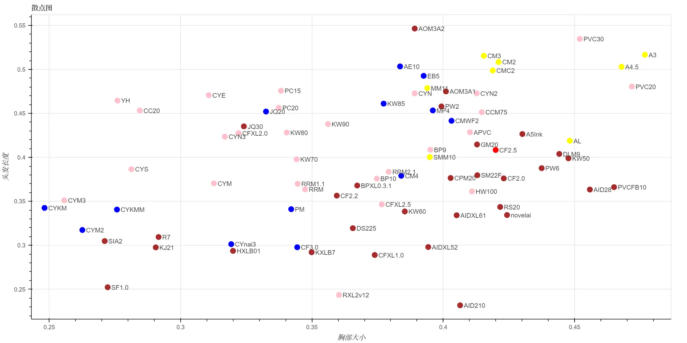

# stable diffusion 动漫标签自动化评测

大家在用stable diffusion的时候，有没有遇到过你用的模型总是不能理解你要的标签的情况？

前几天我就想试试XL模型是不是能解决这类问题。按理说模型更大了，应该更聪明1点。可是下了几个动漫的XL模型，手动测试了1下，好像不仅没有解决不理解标签的问题，还更坏了？

不过感觉毕竟是不准的，1个1个用眼睛看也看不完，不如我来发明1个测试工具，直接把各种模型×各种标签统统测试1遍，这样就知道它们到底准不准了！

## 单标签测试

第1项测试比较简单，我们来测试1下模型是否能正确地画出各种类的标签。横座标是模型的名字，纵座标是标签分类，表格的数值是准确率。

- 准确率的意思是，假如我用`AOM3A1`模型，生成了`n`张包含`人物-动作`tag的图片，即每张的prompt中包含1个随机的`人物-动作`tag，然后用ML-Danbooru检测这`n`张图片，能被预测出和prompt中相同的tag的张数为`k`，那么`AOM3A1`×`人物-动作`的准确率就是`k/n`。

- 采样方法是选择使用率最高的前1500个标签，然后用每个模型给每个标签生成16张图，再把标签分到对应的分类里。因此标签的样本数是均匀的，但是分类的样本数不是均匀的。

评测的模型是这样挑选的，在Civitai上选了比较热门的模型系列，然后从每个系列中选出几个下载量较大的模型来测试，也测了几个我自己比较喜欢的模型。

- 表格长度不够，因此挑了1些模型出来展示，并且同1系列的模型里只显示了效果最好的那个，比如Counterfeit3.0比Counterfeit2.2好，所以2.2就没有显示。

- 如果你想看完整的表格，在[测试结果](./测试结果)里，因为它太大了所以就不贴上来了。

- 如果你有什么想试的模型也可以告诉我，我1起加进来。

|                          | A5Ink     | AL      | AOM3A1    | BP10      | CF3.0     | CM4       | CYS       | KW70    | RRM3.2    | SF1.0     | novelai   | CFXL2.5   | KXLB7     |
|:-------------------------|:----------|:--------|:----------|:----------|:----------|:----------|:----------|:--------|:----------|:----------|:----------|:----------|:----------|
| 艺术破格                 | 0.171     | 0.15    | 0.104     | **0.212** | 0.204     | 0.167     | 0.142     | 0.138   | 0.154     | **0.221** | **0.246** | 0.2       | 0.204     |
| 人物-动作                | 0.5       | 0.539   | 0.518     | **0.588** | **0.565** | 0.546     | 0.563     | 0.502   | **0.607** | 0.551     | 0.485     | 0.385     | 0.547     |
| 人物-全身装饰            | 0.664     | 0.602   | 0.734     | 0.773     | 0.758     | 0.719     | **0.789** | 0.773   | **0.859** | 0.695     | 0.609     | 0.727     | **0.875** |
| 人物-胸部                | 0.438     | 0.449   | **0.518** | 0.476     | **0.478** | 0.431     | 0.45      | 0.373   | **0.486** | 0.435     | 0.457     | 0.313     | 0.39      |
| 人物-衣装                | 0.758     | 0.784   | 0.79      | **0.811** | **0.809** | **0.809** | 0.78      | 0.725   | **0.828** | 0.792     | 0.755     | 0.752     | 0.778     |
| 人物-摆位                | 0.555     | 0.55    | 0.53      | 0.652     | **0.665** | 0.578     | 0.608     | 0.57    | 0.645     | **0.662** | 0.598     | 0.555     | **0.757** |
| 人物-耳朵                | 0.845     | 0.848   | 0.842     | 0.839     | **0.884** | 0.866     | 0.815     | 0.815   | **0.887** | **0.914** | 0.821     | 0.765     | 0.821     |
| 人物-面部                | 0.467     | 0.455   | 0.443     | **0.537** | **0.55**  | 0.49      | 0.448     | 0.463   | **0.569** | 0.494     | 0.484     | 0.354     | 0.489     |
| 人物-头发                | 0.633     | 0.606   | 0.581     | **0.678** | **0.678** | 0.634     | 0.555     | 0.546   | **0.659** | 0.597     | 0.633     | 0.509     | 0.61      |
| 人物-头部饰品            | 0.744     | 0.749   | 0.713     | **0.822** | **0.823** | 0.786     | 0.778     | 0.736   | 0.818     | **0.827** | 0.704     | 0.606     | 0.79      |
| 人物-类型                | 0.661     | 0.649   | 0.644     | **0.725** | 0.688     | 0.651     | 0.67      | 0.596   | **0.719** | 0.68      | 0.64      | 0.628     | **0.763** |
| 人物-下身装饰            | 0.71      | 0.726   | 0.749     | **0.76**  | **0.781** | 0.747     | 0.742     | 0.698   | **0.776** | 0.74      | 0.708     | 0.601     | 0.748     |
| 人物-脖子                | 0.768     | 0.794   | 0.786     | **0.814** | 0.808     | **0.822** | 0.75      | 0.724   | **0.811** | 0.753     | 0.778     | 0.699     | 0.74      |
| 人物-鞋袜                | 0.679     | 0.696   | 0.681     | **0.732** | **0.742** | **0.732** | 0.708     | 0.699   | **0.761** | 0.726     | 0.663     | 0.589     | 0.713     |
| 人物-上身装饰            | 0.737     | 0.779   | 0.746     | **0.8**   | **0.793** | 0.779     | 0.756     | 0.706   | **0.806** | 0.767     | 0.712     | 0.688     | 0.737     |
| 人文景观-建筑物     | 0.938     | 0.966   | 0.903     | 0.96      | 0.886     | 0.932     | 0.955     | 0.943   | **0.977** | 0.966     | 0.903     | **0.972** | **0.989** |
| 人文景观-谷制品     | 0.688     | 0.713   | 0.713     | 0.825     | 0.8       | 0.787     | 0.938     | 0.825   | 0.938     | **1.0**   | 0.575     | **1.0**   | **1.0**   |
| 人文景观-饮料       | 0.836     | 0.859   | 0.781     | 0.898     | 0.812     | 0.844     | 0.914     | 0.844   | **0.922** | **0.938** | 0.656     | 0.852     | **0.977** |
| 人文景观-水果       | 0.868     | 0.868   | 0.889     | 0.847     | 0.889     | 0.896     | 0.931     | 0.854   | **0.944** | **0.986** | 0.833     | 0.917     | **0.993** |
| 人文景观-主食       | 0.762     | 0.787   | 0.725     | 0.825     | 0.8       | 0.775     | 0.875     | 0.838   | **0.9**   | 0.825     | 0.713     | **1.0**   | **0.988** |
| 人文景观-肉类与海鲜 | 0.922     | 0.734   | 0.906     | 0.891     | **0.984** | 0.953     | 0.906     | 0.828   | 0.953     | **1.0**   | 0.781     | **1.0**   | **0.984** |
| 人文景观-糖果零食   | 0.8       | 0.819   | 0.722     | **0.878** | 0.859     | 0.825     | 0.863     | 0.838   | **0.922** | **0.894** | 0.688     | 0.806     | 0.866     |
| 人文景观-蔬菜与香料 | 0.938     | 0.906   | 0.896     | **0.969** | 0.938     | 0.885     | **0.979** | 0.948   | **0.969** | **0.979** | 0.958     | 0.667     | 0.896     |
| 人文景观-室内       | 0.991     | **1.0** | 0.991     | **1.0**   | 0.92      | 0.991     | **1.0**   | 0.973   | **1.0**   | 0.991     | 0.946     | **1.0**   | **1.0**   |
| 人文景观-室外       | **1.0**   | **1.0** | 0.958     | **1.0**   | **1.0**   | **1.0**   | **1.0**   | **1.0** | **1.0**   | **1.0**   | 0.969     | 0.969     | **1.0**   |
| 构图-背景                | 0.861     | 0.885   | 0.803     | **0.933** | 0.894     | **0.904** | 0.899     | 0.856   | **0.933** | 0.827     | 0.808     | 0.851     | 0.875     |
| 构图-打码方式            | 0.151     | 0.219   | **0.359** | 0.198     | 0.219     | 0.135     | **0.312** | 0.151   | **0.286** | 0.193     | 0.203     | 0.25      | 0.266     |
| 构图-色彩                | 0.442     | 0.388   | 0.304     | **0.721** | **0.704** | 0.517     | 0.421     | 0.358   | 0.65      | 0.492     | 0.558     | 0.662     | **0.787** |
| 构图-构图方式            | 0.301     | 0.375   | 0.318     | **0.432** | 0.369     | **0.409** | **0.409** | 0.284   | **0.438** | 0.369     | 0.284     | 0.273     | 0.358     |
| 构图-制图特效            | 0.551     | 0.643   | 0.467     | **0.713** | **0.776** | 0.643     | 0.662     | 0.592   | **0.702** | 0.68      | 0.636     | 0.607     | 0.673     |
| 构图-图片类型            | **0.435** | 0.386   | 0.332     | 0.416     | 0.383     | 0.397     | 0.41      | 0.429   | **0.484** | 0.351     | 0.421     | 0.293     | **0.448** |
| 构图-视角                | 0.738     | 0.7     | 0.667     | **0.808** | 0.8       | 0.742     | 0.75      | 0.8     | **0.825** | **0.804** | 0.758     | 0.746     | 0.746     |
| 构图-画风                | 0.237     | 0.147   | 0.205     | 0.295     | 0.304     | 0.214     | 0.246     | 0.232   | **0.33**  | 0.188     | 0.321     | **0.326** | **0.571** |
| 物品                     | 0.792     | 0.765   | 0.804     | **0.881** | **0.878** | **0.893** | 0.824     | 0.735   | **0.878** | 0.839     | 0.801     | 0.729     | 0.845     |
| 自然景观-花卉            | 0.895     | 0.92    | 0.855     | 0.989     | 0.943     | 0.972     | 0.949     | 0.852   | **0.994** | 0.983     | 0.761     | **1.0**   | **1.0**   |
| 自然景观-室外       | 0.943     | 0.953   | 0.927     | **1.0**   | 0.995     | 0.964     | 0.958     | 0.969   | 0.979     | 0.99      | 0.953     | **1.0**   | **1.0**   |
| 自然景观-气象       | 0.891     | 0.922   | 0.87      | **0.974** | 0.87      | 0.885     | 0.906     | 0.891   | 0.927     | 0.901     | 0.807     | **0.99**  | **1.0**   |
| 限制级-成年限定          | 0.318     | 0.296   | **0.572** | 0.418     | 0.41      | 0.233     | **0.432** | 0.266   | **0.518** | 0.383     | 0.333     | 0.37      | 0.427     |
| 限制级-限制级            | 0.542     | 0.477   | **0.639** | 0.572     | 0.62      | 0.475     | 0.576     | 0.433   | **0.653** | 0.475     | 0.516     | 0.396     | **0.667** |
| 总体                     | 0.622     | 0.628   | 0.628     | **0.688** | **0.683** | 0.646     | 0.644     | 0.6     | **0.704** | 0.656     | 0.614     | 0.564     | 0.668     |

> 为了缩减长度缩写了1下。A指anything，AL指anylora，BP指blue_pencil，CF指Counterfeit，CYS指cuteyukimixAdorable_specialchapter，KW指kaywaii，SF指sweetfruit_melon，SM指sakuramochimix。
> 
> 加粗表示它是当前标签的top3。

可以看出: 

- 表现比较优秀的模型是blue_pencil_v10、Counterfeit-3.0、rimochan_random_mix。

- XL模型总的来说并没有比原版模型更准确。

## 多标签测试-准确度

接下来是测试模型在单张图片的标签数变多时，是会顾此失彼，还是能把这些标签都画出来。同上，横座标是模型的名字，纵座标是标签分类，表格的数值是准确率。

- 准确率的意思是，假如我用`AOM3A1`模型，生成了`n`张包含`m`个tag的图片，即每张的prompt中包含`m`个随机的tag，然后用ML-Danbooru检测这`n`张图片，每张图片中能被预测出和prompt中相同的tag的数量总和为`k`，那么`AOM3A1`×`n tags`的准确率就是`k/(n*m)`。

- 采样方法是每次从使用率最高的前1500个tag中随机抽取`m`个，然后用每个模型给这1次的`m`个tag生成16张图。

|     |   A5Ink |    AL |   AOM3A1 | BP10      | CF3.0     | CM4       |   CYS | KW70      | RRM3.2    |   SF1.0 |   novelai |   CFXL2.5 |   KXLB7 |
|----:|--------:|------:|---------:|:----------|:----------|:----------|------:|:----------|:----------|--------:|----------:|----------:|--------:|
|   2 |   0.477 | 0.497 |    0.481 | **0.546** | **0.54**  | 0.513     | 0.513 | 0.487     | **0.553** |   0.527 |     0.454 |     0.447 |   0.494 |
|   4 |   0.431 | 0.448 |    0.439 | **0.484** | **0.482** | 0.465     | 0.461 | 0.454     | **0.52**  |   0.473 |     0.399 |     0.394 |   0.451 |
|   8 |   0.346 | 0.381 |    0.363 | **0.409** | **0.406** | 0.391     | 0.385 | 0.395     | **0.446** |   0.393 |     0.324 |     0.34  |   0.375 |
|  16 |   0.275 | 0.303 |    0.287 | **0.333** | **0.328** | 0.324     | 0.312 | 0.317     | **0.375** |   0.318 |     0.253 |     0.279 |   0.302 |
|  32 |   0.207 | 0.232 |    0.221 | **0.253** | **0.245** | **0.245** | 0.24  | **0.245** | **0.292** |   0.243 |     0.19  |     0.216 |   0.212 |
|  64 |   0.152 | 0.171 |    0.166 | **0.186** | **0.181** | 0.179     | 0.179 | 0.179     | **0.221** |   0.176 |     0.139 |     0.17  |   0.154 |
| 128 |   0.118 | 0.131 |    0.129 | **0.144** | **0.142** | 0.138     | 0.139 | 0.138     | **0.174** |   0.136 |     0.111 |     0.137 |   0.121 |

看来多标签的标准下，表现最优秀的还是blue_pencil_v10、Counterfeit-3.0、rimochan_random_mix。

## 多标签测试-多样性

接下来来测试模型生成图片的多样性。横座标是模型的名字，纵座标是标签分类，表格的数值是多样性。

- 多样性的意思是，假如我用`AOM3A1`模型，在相同tag下生成了`n`张图片，将每1张图和它的后1张图过CLIP之后计算embedding的余弦相似度，`1-这些余弦相似度的平均值`即为`AOM3A1`×`n tags`的多样性。

|     | A5Ink     |    AL |   AOM3A1 |   BP10 |   CF3.0 |   CM4 | CYS       | KW70      |   RRM3.2 |   SF1.0 | novelai   |   CFXL2.5 |   KXLB7 |
|----:|:----------|------:|---------:|-------:|--------:|------:|:----------|:----------|---------:|--------:|:----------|----------:|--------:|
|   2 | **0.147** | 0.142 |    0.146 |  0.13  |   0.136 | 0.143 | **0.147** | **0.148** |    0.141 |   0.137 | **0.181** |     0.1   |   0.12  |
|   4 | 0.136     | 0.132 |    0.131 |  0.121 |   0.129 | 0.134 | **0.143** | **0.144** |    0.136 |   0.129 | **0.173** |     0.097 |   0.126 |
|   8 | 0.129     | 0.13  |    0.122 |  0.117 |   0.126 | 0.127 | **0.143** | **0.136** |    0.13  |   0.126 | **0.168** |     0.096 |   0.13  |
|  16 | 0.129     | 0.125 |    0.116 |  0.115 |   0.125 | 0.12  | **0.143** | **0.137** |    0.129 |   0.123 | **0.166** |     0.095 |   0.13  |
|  32 | 0.121     | 0.126 |    0.112 |  0.117 |   0.127 | 0.127 | **0.145** | **0.146** |    0.133 |   0.126 | **0.157** |     0.093 |   0.134 |
|  64 | 0.131     | 0.131 |    0.112 |  0.121 |   0.135 | 0.13  | **0.154** | **0.151** |    0.144 |   0.14  | **0.162** |     0.101 |   0.141 |
| 128 | 0.127     | 0.132 |    0.11  |  0.125 |   0.142 | 0.137 | **0.159** | **0.162** |    0.146 |   0.143 | **0.156** |     0.099 |   0.135 |

最多样的是novelai，这个模型确实多样化程度很高，其他的像kaywaii、cuteyukimix也不错。

画了1张图，表示当tag数量为32时，各个模型的准确度和多样性，是这样——

## 角色偏好测试

顺便测了1下，模型在没有收到特定的prompt时，会倾向于生成什么样的角色。

数据是将「单标签测试」的模型预测结果中每张图片的标签统计之后的结果。因为这个是搞笑的，所以就不解释计算规则了。画了一张图，是这样——

圆形的颜色代表的是，在生成的图片中出现次数最多的头发颜色标签。

## 画风测试

画风量化起来不是很方便。不过好在这个东西用眼睛看也不难，所以用相同的prompt为每个模型生成了几张样例图片。

我先放1个「街上的双马尾JK」在这里，其他的样例大家可以到[img](./img)文件夹里面看。

## 使用方法

- 首先你要有1个[stable-diffusion-webui](https://github.com/AUTOMATIC1111/stable-diffusion-webui)。运行`webui-user.bat`，启动参数需要加上`--api`。

- 安装依赖: `pip install -r requirements.txt`。

- 运行评测代码: `python 评测单标签.py`或`python 评测多标签.py`。会生成`记录.json`或`记录_多标签.json`文件，包含1个巨大的list。

- 导出表格: `python 导出表格.py`。会读取记录文件，生成`好.md`文件，里面就是以表格形式打出的指标了。

## 结束

顺便说1下，标签目录是从<https://github.com/wfjsw/danbooru-diffusion-prompt-builder>扣出来的，但是因为我是傲娇所以不会感谢她！

就这样，大家88，我要回去和GPT亲热了！
