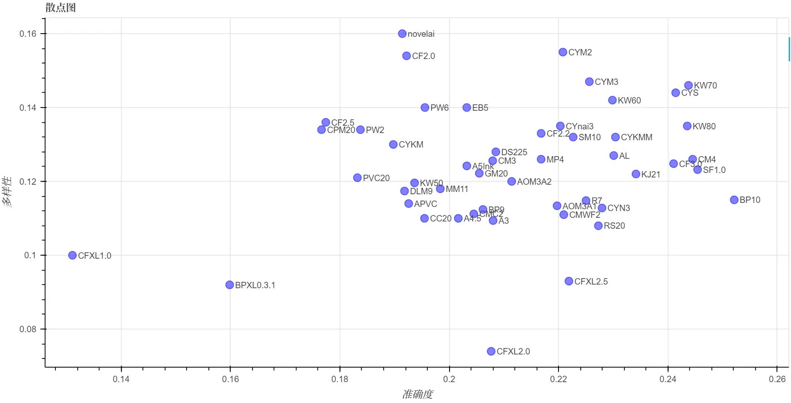
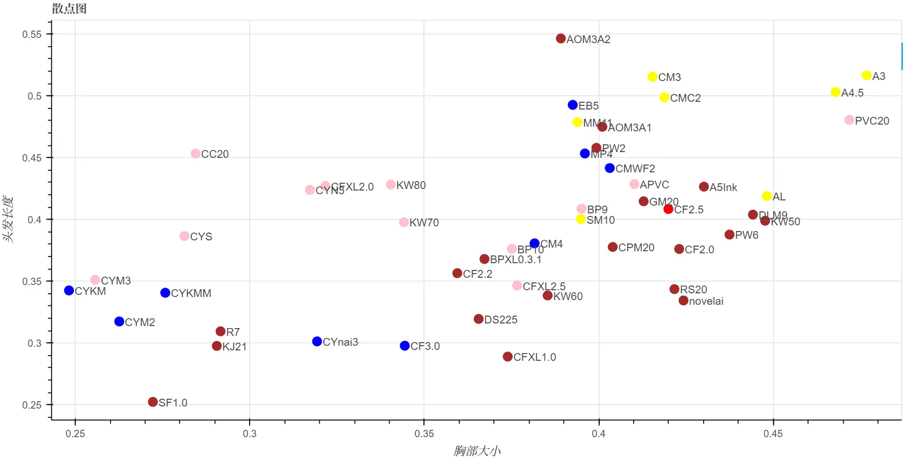

# stable diffusion 动漫标签自动化评测

大家在用stable diffusion的时候，有没有遇到过你用的模型总是不能理解你要的标签的情况？

前几天我就想试试XL模型是不是能解决这类问题。按理说模型更大了，应该更聪明1点。可是下了几个动漫的XL模型，手动测试了1下，好像不仅没有解决不理解标签的问题，还更坏了？

不过感觉毕竟是不准的，1个1个用眼睛看也看不完，不如我来发明1个测试工具，直接把各种模型×各种标签统统测试1遍，这样就知道它们到底准不准了！

## 单标签测试

第1项测试比较简单，我们来测试1下模型是否能正确地画出各种类的标签。横座标是模型的名字，纵座标是标签分类，表格的数值是准确率。

- 准确率的意思是，假如我用`AOM3A1`模型，生成了`n`张包含`人物-动作`tag的图片，即每张的prompt中包含1个随机的`人物-动作`tag，然后用ML-Danbooru检测这`n`张图片，能被预测出和prompt中相同的tag的张数为`k`，那么`AOM3A1`×`人物-动作`的准确率就是`k/n`。

- 采样方法是选择使用率最高的前1500个标签，然后用每个模型给每个标签生成16张图，再把标签分到对应的分类里。因此标签的样本数是均匀的，但是分类的样本数不是均匀的。

评测的模型是这样挑选的，在Civitai上选了比较热门的模型系列，然后从每个系列中选出几个下载量较大的模型来测试，也测了几个我自己比较喜欢的模型。

- 表格长度不够，因此挑了1些模型出来展示，并且同1系列的模型里只显示了效果最好的那个，比如Counterfeit3.0比Counterfeit2.2好，所以2.2就没有显示。

- 如果你想看完整的表格，在[这里](./好.md)，因为它太大了所以就不贴上来了。

- 如果你有什么想试的模型也可以告诉我，我1起加进来。

|                          | A5Ink     | AL        | AOM3A1    | BP10      | CF3.0     | CM4       | CYS       | KW80      | MM11   | SF1.0     | SM10     | novelai   | BPXL0.3.1   | CFXL1.0   |
|:-------------------------|:----------|:----------|:----------|:----------|:----------|:----------|:----------|:----------|:-------|:----------|:---------|:----------|:------------|:----------|
| 艺术破格                 | 0.197     | 0.173     | 0.12      | **0.245** | 0.231     | 0.192     | 0.163     | 0.135     | 0.106  | **0.255** | 0.188    | **0.274** | 0.163       | 0.178     |
| 人物-动作                | 0.504     | 0.543     | 0.522     | **0.593** | **0.569** | 0.55      | **0.568** | 0.495     | 0.495  | 0.556     | 0.521    | 0.488     | 0.442       | 0.427     |
| 人物-全身装饰            | 0.664     | 0.602     | 0.734     | **0.773** | 0.758     | 0.719     | **0.789** | 0.672     | 0.594  | 0.695     | 0.625    | 0.609     | 0.688       | **0.836** |
| 人物-胸部                | 0.464     | 0.477     | **0.549** | **0.506** | **0.508** | 0.458     | 0.478     | 0.423     | 0.446  | 0.462     | 0.45     | 0.486     | 0.309       | 0.332     |
| 人物-衣装                | 0.758     | 0.784     | 0.79      | **0.811** | **0.809** | **0.809** | 0.78      | 0.718     | 0.774  | 0.792     | 0.782    | 0.755     | 0.753       | 0.74      |
| 人物-摆位                | 0.578     | 0.573     | 0.552     | **0.68**  | **0.693** | 0.602     | 0.633     | 0.591     | 0.51   | **0.688** | 0.552    | 0.622     | 0.599       | 0.646     |
| 人物-耳朵                | 0.845     | 0.848     | 0.842     | 0.839     | **0.884** | **0.866** | 0.815     | 0.771     | 0.818  | **0.914** | 0.836    | 0.821     | 0.821       | 0.753     |
| 人物-面部                | 0.506     | 0.493     | 0.48      | **0.582** | **0.596** | 0.531     | 0.484     | 0.488     | 0.426  | **0.534** | 0.504    | 0.525     | 0.317       | 0.371     |
| 人物-头发                | 0.653     | 0.626     | 0.6       | **0.701** | **0.7**   | **0.655** | 0.573     | 0.567     | 0.591  | 0.617     | 0.631    | 0.654     | 0.559       | 0.563     |
| 人物-头部饰品            | 0.751     | 0.757     | 0.719     | **0.831** | **0.831** | 0.794     | 0.786     | 0.739     | 0.748  | **0.836** | 0.803    | 0.71      | 0.611       | 0.628     |
| 人物-类型                | 0.682     | 0.67      | 0.664     | **0.748** | **0.71**  | 0.672     | 0.692     | 0.631     | 0.626  | **0.702** | 0.678    | 0.659     | 0.673       | 0.649     |
| 人物-下身装饰            | 0.71      | 0.726     | **0.749** | **0.76**  | **0.781** | 0.747     | 0.742     | 0.713     | 0.696  | 0.74      | 0.733    | 0.708     | 0.598       | 0.629     |
| 人物-脖子                | 0.789     | 0.816     | 0.807     | **0.836** | **0.829** | **0.845** | 0.77      | 0.743     | 0.801  | 0.774     | 0.78     | 0.799     | 0.684       | 0.715     |
| 人物-鞋袜                | 0.707     | 0.726     | 0.71      | **0.763** | **0.774** | **0.763** | 0.738     | 0.717     | 0.699  | 0.757     | 0.737    | 0.691     | 0.653       | 0.633     |
| 人物-上身装饰            | 0.764     | 0.808     | 0.774     | **0.829** | **0.823** | **0.809** | 0.784     | 0.752     | 0.79   | 0.796     | 0.776    | 0.739     | 0.706       | 0.704     |
| 人文景观-建筑物     | 0.938     | **0.966** | 0.903     | **0.96**  | 0.886     | 0.932     | 0.955     | 0.949     | 0.881  | **0.966** | 0.926    | 0.903     | 0.943       | 0.869     |
| 人文景观-谷制品     | 0.688     | 0.713     | 0.713     | 0.825     | 0.8       | 0.787     | 0.938     | 0.787     | 0.738  | **1.0**   | 0.775    | 0.575     | **1.0**     | **0.95**  |
| 人文景观-饮料       | 0.836     | 0.859     | 0.781     | 0.898     | 0.812     | 0.844     | **0.914** | 0.844     | 0.883  | **0.938** | 0.82     | 0.656     | **0.914**   | **0.922** |
| 人文景观-水果       | 0.868     | 0.868     | 0.889     | 0.847     | 0.889     | 0.896     | 0.931     | 0.861     | 0.826  | **0.986** | 0.917    | 0.833     | **0.993**   | **0.993** |
| 人文景观-主食       | 0.762     | 0.787     | 0.725     | **0.825** | 0.8       | 0.775     | **0.875** | **0.825** | 0.675  | **0.825** | 0.775    | 0.713     | **0.838**   | **0.825** |
| 人文景观-肉类     | 0.922     | 0.734     | 0.906     | 0.891     | **0.984** | 0.953     | 0.906     | 0.766     | 0.844  | **1.0**   | 0.906    | 0.781     | **1.0**     | **0.984** |
| 人文景观-零食     | 0.8       | 0.819     | 0.722     | **0.878** | 0.859     | 0.825     | 0.863     | 0.85      | 0.772  | **0.894** | 0.831    | 0.688     | **0.875**   | 0.831     |
| 人文景观-蔬菜    | 0.938     | 0.906     | 0.896     | **0.969** | 0.938     | 0.885     | **0.979** | 0.938     | 0.844  | **0.979** | 0.958    | 0.958     | 0.875       | 0.885     |
| 人文景观-室内       | 0.991     | **1.0**   | 0.991     | **1.0**   | 0.92      | 0.991     | **1.0**   | 0.973     | 0.964  | 0.991     | 0.973    | 0.946     | **1.0**     | **1.0**   |
| 人文景观-室外       | **1.0**   | **1.0**   | 0.958     | **1.0**   | **1.0**   | **1.0**   | **1.0**   | **1.0**   | 0.979  | **1.0**   | 0.979    | 0.969     | **1.0**     | **1.0**   |
| 构图-背景                | 0.861     | 0.885     | 0.803     | **0.933** | 0.894     | **0.904** | **0.899** | 0.846     | 0.817  | 0.827     | 0.885    | 0.808     | 0.856       | 0.822     |
| 构图-打码方式            | 0.165     | **0.239** | **0.392** | 0.216     | **0.239** | 0.148     | **0.341** | 0.188     | 0.153  | 0.21      | 0.188    | 0.216     | 0.006       | 0.028     |
| 构图-色彩                | 0.473     | 0.415     | 0.326     | **0.772** | **0.754** | 0.554     | 0.451     | 0.362     | 0.42   | 0.527     | 0.531    | 0.598     | 0.612       | **0.763** |
| 构图-构图方式            | 0.331     | 0.412     | 0.35      | **0.475** | 0.406     | **0.45**  | **0.45**  | 0.331     | 0.287  | 0.406     | 0.388    | 0.312     | 0.125       | 0.138     |
| 构图-制图特效            | 0.551     | 0.643     | 0.467     | **0.713** | **0.776** | 0.643     | 0.662     | 0.577     | 0.555  | **0.68**  | 0.544    | 0.636     | 0.518       | 0.504     |
| 构图-图片类型            | **0.526** | 0.467     | 0.401     | 0.5       | 0.464     | 0.48      | 0.497     | 0.457     | 0.385  | 0.424     | **0.53** | **0.507** | 0.155       | 0.178     |
| 构图-视角                | 0.738     | 0.7       | 0.667     | **0.808** | **0.8**   | 0.742     | 0.75      | 0.717     | 0.683  | **0.804** | 0.738    | 0.758     | 0.7         | 0.675     |
| 构图-画风                | 0.301     | 0.188     | 0.261     | **0.375** | **0.386** | 0.273     | 0.312     | 0.261     | 0.182  | 0.239     | 0.278    | **0.409** | 0.335       | 0.312     |
| 物品                     | 0.831     | 0.803     | 0.844     | **0.925** | **0.922** | **0.938** | 0.866     | 0.791     | 0.812  | 0.881     | 0.894    | 0.841     | 0.844       | 0.819     |
| 自然景观-花卉            | 0.895     | 0.92      | 0.855     | **0.989** | 0.943     | 0.972     | 0.949     | 0.889     | 0.949  | **0.983** | 0.943    | 0.761     | **0.974**   | 0.966     |
| 自然景观-室外       | 0.943     | 0.953     | 0.927     | **1.0**   | 0.995     | 0.964     | 0.958     | 0.979     | 0.943  | 0.99      | 0.943    | 0.953     | **1.0**     | **1.0**   |
| 自然景观-气象       | 0.891     | 0.922     | 0.87      | **0.974** | 0.87      | 0.885     | 0.906     | 0.885     | 0.885  | 0.901     | 0.87     | 0.807     | **1.0**     | **0.938** |
| 限制级-成年限定          | 0.324     | 0.302     | **0.584** | **0.427** | 0.419     | 0.238     | **0.441** | 0.283     | 0.262  | 0.391     | 0.285    | 0.34      | 0.085       | 0.112     |
| 限制级-限制级            | 0.562     | 0.495     | **0.663** | 0.594     | **0.644** | 0.493     | **0.599** | 0.469     | 0.457  | 0.493     | 0.495    | 0.536     | 0.312       | 0.404     |

> 为了缩减长度缩写了1下。A指anything，AL指anylora，BP指blue_pencil，CF指Counterfeit，CYS指cuteyukimixAdorable_specialchapter，KW指kaywaii，SF指sweetfruit_melon，SM指sakuramochimix。
> 
> 加粗表示它是当前标签的top3。

可以看出: 

- 表现比较优秀的模型是blue_pencil_v10、Counterfeit-3.0、sweetfruit_melon。

- XL模型普遍不如原版模型准，只在1些无关紧要的方面有优势。

## 多标签测试-准确度

接下来是测试模型在单张图片的标签数变多时，是会顾此失彼，还是能把这些标签都画出来。同上，横座标是模型的名字，纵座标是标签分类，表格的数值是准确率。

- 准确率的意思是，假如我用`AOM3A1`模型，生成了`n`张包含`m`个tag的图片，即每张的prompt中包含`m`个随机的tag，然后用ML-Danbooru检测这`n`张图片，每张图片中能被预测出和prompt中相同的tag的数量总和为`k`，那么`AOM3A1`×`n tags`的准确率就是`k/(n*m)`。

- 采样方法是每次从使用率最高的前1500个tag中随机抽取`m`个，然后用每个模型给这1次的`m`个tag生成16张图。

|     |   A5Ink |    AL |   AOM3A1 | BP10      | CF3.0     | CM4       | CYS       | KW80      |   MM11 | SF1.0     |   SM10 |   novelai |   BPXL0.3.1 |   CFXL1.0 |
|----:|--------:|------:|---------:|:----------|:----------|:----------|:----------|:----------|-------:|:----------|-------:|----------:|------------:|----------:|
|   2 |   0.466 | 0.471 |    0.464 | **0.514** | **0.502** | 0.481     | **0.49**  | 0.452     |  0.421 | 0.482     |  0.478 |     0.452 |       0.392 |     0.396 |
|   4 |   0.421 | 0.431 |    0.428 | **0.474** | **0.466** | 0.451     | 0.449     | 0.418     |  0.406 | **0.461** |  0.432 |     0.387 |       0.346 |     0.329 |
|   8 |   0.357 | 0.388 |    0.367 | **0.412** | **0.405** | 0.392     | 0.385     | 0.386     |  0.34  | **0.398** |  0.369 |     0.33  |       0.279 |     0.249 |
|  16 |   0.282 | 0.305 |    0.293 | **0.335** | **0.331** | **0.328** | 0.303     | 0.318     |  0.259 | 0.315     |  0.298 |     0.257 |       0.224 |     0.18  |
|  32 |   0.205 | 0.23  |    0.22  | **0.252** | 0.242     | **0.244** | 0.241     | **0.244** |  0.198 | **0.245** |  0.223 |     0.191 |       0.16  |     0.131 |
|  64 |   0.153 | 0.172 |    0.168 | **0.188** | **0.185** | **0.182** | **0.182** | 0.18      |  0.149 | 0.178     |  0.16  |     0.14  |       0.112 |     0.095 |
| 128 |   0.118 | 0.131 |    0.129 | **0.144** | **0.142** | 0.138     | **0.139** | 0.136     |  0.114 | 0.136     |  0.125 |     0.111 |       0.085 |     0.071 |

看来多标签的标准下，表现最优秀的还是blue_pencil_v10、Counterfeit-3.0、sweetfruit_melon。

## 多标签测试-多样性

接下来来测试模型生成图片的多样性。横座标是模型的名字，纵座标是标签分类，表格的数值是多样性。

- 多样性的意思是，假如我用`AOM3A1`模型，在相同tag下生成了`n`张图片，将每1张图和它的后1张图过CLIP之后计算embedding的余弦相似度，`1-这些余弦相似度的平均值`即为`AOM3A1`×`n tags`的多样性。

|     |   A5Ink |    AL |   AOM3A1 |   BP10 |   CF3.0 |   CM4 | CYS       | KW80      | MM11      |   SF1.0 | SM10      | novelai   |   BPXL0.3.1 |   CFXL1.0 |
|----:|--------:|------:|---------:|-------:|--------:|------:|:----------|:----------|:----------|--------:|:----------|:----------|------------:|----------:|
|   2 |   0.142 | 0.138 |    0.141 |  0.126 |   0.132 | 0.141 | 0.141     | 0.133     | **0.143** |   0.136 | **0.145** | **0.173** |       0.104 |     0.098 |
|   4 |   0.13  | 0.128 |    0.128 |  0.121 |   0.126 | 0.133 | **0.141** | 0.131     | 0.126     |   0.131 | **0.14**  | **0.168** |       0.091 |     0.094 |
|   8 |   0.128 | 0.128 |    0.122 |  0.114 |   0.124 | 0.126 | **0.142** | 0.128     | 0.125     |   0.123 | **0.134** | **0.164** |       0.097 |     0.105 |
|  16 |   0.13  | 0.123 |    0.118 |  0.115 |   0.125 | 0.12  | **0.144** | 0.124     | 0.121     |   0.125 | **0.131** | **0.165** |       0.093 |     0.098 |
|  32 |   0.124 | 0.127 |    0.114 |  0.115 |   0.125 | 0.125 | **0.144** | **0.135** | 0.118     |   0.124 | 0.132     | **0.16**  |       0.092 |     0.1   |
|  64 |   0.132 | 0.131 |    0.112 |  0.121 |   0.136 | 0.129 | **0.155** | **0.145** | 0.128     |   0.139 | 0.141     | **0.162** |       0.095 |     0.108 |
| 128 |   0.127 | 0.132 |    0.11  |  0.125 |   0.142 | 0.137 | **0.159** | **0.148** | 0.126     |   0.143 | 0.139     | **0.156** |       0.098 |     0.108 |

最多样的是novelai，这个模型确实多样化程度很高，其他的像Counterfeit-2.2、cuteyukimix也不错。不过这几个模型的准确度不是很高，看来多样性和准确性似乎是逆相关的。

画了1张图，表示当tag数量为32时，各个模型的准确度和多样性，是这样——

## 角色偏好测试

顺便测了1下，模型在没有收到特定的prompt时，会倾向于生成什么样的角色。

数据是将「单标签测试」的模型预测结果中每张图片的标签统计之后的结果。因为这个是搞笑的，所以就不解释计算规则了。画了一张图，是这样——

圆形的颜色代表的是，在生成的图片中出现次数最多的头发颜色标签。

## 使用方法

- 首先你要有1个[stable-diffusion-webui](https://github.com/AUTOMATIC1111/stable-diffusion-webui)。运行`webui-user.bat`，启动参数需要加上`--api`。

- 安装依赖: `pip install -r requirements.txt`。

- 运行评测代码: `python 评测单标签.py`或`python 评测多标签.py`。会生成`记录.json`或`记录_多标签.json`文件，包含1个巨大的list。

- 导出表格: `python 导出表格.py`。会读取记录文件，生成`好.md`文件，里面就是以表格形式打出的指标了。

## 结束

顺便说1下，标签目录是从<https://github.com/wfjsw/danbooru-diffusion-prompt-builder>扣出来的，但是因为我是傲娇所以不会感谢她！

就这样，大家88，我要回去和GPT亲热了！
