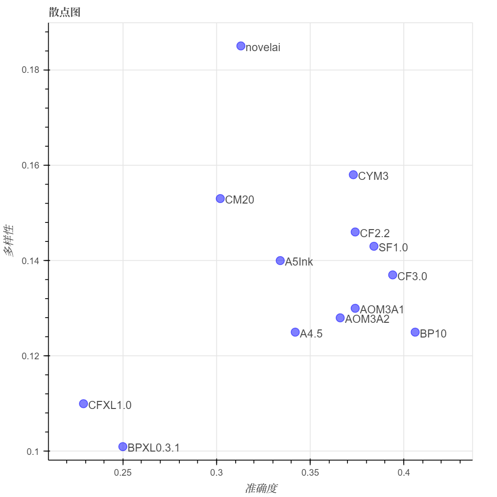

# stable diffusion 动漫标签自动化评测

大家在用stable diffusion的时候，有没有遇到过你用的模型总是不能理解你要的标签的情况？

前几天我就想试试XL模型是不是能解决这类问题。按理说模型更大了，应该更聪明1点。可是下了几个动漫的XL模型，手动测试了1下，好像不仅没有解决不理解标签的问题，还更坏了？

不过感觉毕竟是不准的，1个1个用眼睛看也看不完，不如我来发明1个测试工具，直接把各种模型×各种标签统统测试1遍，这样就知道它们到底准不准了！

## 单标签测试

第1项测试比较简单，我们来测试1下模型是否能正确地画出各种类的标签。横座标是模型的名字，纵座标是标签分类，表格的数值是准确率。

- 准确率的意思是，假如我用`AOM3A1`模型，生成了`n`张包含`人物-动作`tag的图片，即每张的prompt中包含1个随机的`人物-动作`tag，然后用ML-Danbooru检测这`n`张图片，能被预测出和prompt中相同的tag的张数为`k`，那么`AOM3A1`×`人物-动作`的准确率就是`k/n`。

- 采样方法是选择使用率最高的前1500个标签，然后用每个模型给每个标签生成16张图，再把标签分到对应的分类里。因此标签的样本数是均匀的，但是分类的样本数不是均匀的。

- 模型没有挑过，我这里恰好有这几个模型，就用它们测了。如果你有什么想试的模型也可以告诉我，我1起加进来。

- 以及还有1个详细的表格，是以标签为纵座标的，在[这里](./好.md)，因为它太大了所以就不贴上来了。

|                          | A5Ink     | AOM3A1    | BP10      | CF3.0     | CM20      | CYM3      | SF1.0     | novelai   | BPXL0.3.1   | CFXL1.0   |
|:-------------------------|:----------|:----------|:----------|:----------|:----------|:----------|:----------|:----------|:------------|:----------|
| 艺术破格                 | 0.197     | 0.12      | **0.245** | 0.231     | 0.183     | 0.173     | **0.255** | **0.274** | 0.163       | 0.178     |
| 人物-动作                | 0.52      | 0.538     | **0.61**  | **0.586** | 0.499     | **0.583** | 0.573     | 0.502     | 0.455       | 0.44      |
| 人物-全身装饰            | 0.664     | 0.734     | **0.773** | **0.758** | **0.758** | 0.734     | 0.695     | 0.609     | 0.688       | **0.836** |
| 人物-胸部                | 0.479     | **0.566** | **0.521** | **0.524** | 0.411     | 0.485     | 0.476     | 0.5       | 0.318       | 0.342     |
| 人物-衣装                | 0.77      | 0.804     | **0.826** | **0.824** | 0.757     | 0.792     | **0.806** | 0.768     | 0.766       | 0.753     |
| 人物-摆位                | 0.578     | 0.552     | **0.68**  | **0.693** | 0.562     | 0.654     | **0.688** | 0.622     | 0.599       | 0.646     |
| 人物-耳朵                | **0.845** | 0.842     | 0.839     | **0.884** | 0.774     | 0.827     | **0.914** | 0.821     | 0.821       | 0.753     |
| 人物-面部                | 0.527     | 0.5       | **0.606** | **0.621** | 0.367     | 0.509     | **0.556** | 0.547     | 0.33        | 0.387     |
| 人物-头发                | **0.683** | 0.627     | **0.733** | **0.731** | 0.611     | 0.587     | 0.645     | **0.683** | 0.585       | 0.589     |
| 人物-头部饰品            | 0.751     | 0.719     | **0.831** | **0.831** | 0.673     | 0.723     | **0.836** | 0.71      | 0.611       | 0.628     |
| 人物-类型                | 0.682     | 0.664     | **0.748** | **0.71**  | 0.639     | 0.695     | **0.702** | 0.659     | 0.673       | 0.649     |
| 人物-下身装饰            | 0.71      | **0.749** | **0.76**  | **0.781** | 0.654     | 0.726     | 0.74      | 0.708     | 0.598       | 0.629     |
| 人物-脖子                | 0.789     | **0.807** | **0.836** | **0.829** | 0.767     | 0.742     | 0.774     | 0.799     | 0.684       | 0.715     |
| 人物-鞋袜                | 0.723     | 0.726     | **0.78**  | **0.791** | 0.7       | 0.736     | **0.773** | 0.707     | 0.667       | 0.645     |
| 人物-上身装饰            | 0.764     | 0.774     | **0.829** | **0.823** | 0.759     | 0.778     | **0.796** | 0.739     | 0.706       | 0.704     |
| 人文景观-位置-建筑物     | 0.938     | 0.903     | **0.96**  | 0.886     | 0.932     | **0.966** | **0.966** | 0.903     | 0.943       | 0.869     |
| 人文景观-食物-谷制品     | 0.688     | 0.713     | 0.825     | 0.8       | 0.75      | 0.925     | **1.0**   | 0.575     | **1.0**     | **0.95**  |
| 人文景观-食物-饮料       | 0.836     | 0.781     | 0.898     | 0.812     | 0.852     | **0.922** | **0.938** | 0.656     | 0.914       | **0.922** |
| 人文景观-食物-水果       | 0.868     | 0.889     | 0.847     | 0.889     | 0.792     | 0.951     | **0.986** | 0.833     | **0.993**   | **0.993** |
| 人文景观-食物-主食       | 0.762     | 0.725     | **0.825** | 0.8       | 0.775     | **0.838** | **0.825** | 0.713     | **0.838**   | **0.825** |
| 人文景观-食物-肉类 | 0.922     | 0.906     | 0.891     | **0.984** | 0.828     | 0.859     | **1.0**   | 0.781     | **1.0**     | **0.984** |
| 人文景观-食物-零食   | 0.8       | 0.722     | **0.878** | 0.859     | 0.719     | 0.847     | **0.894** | 0.688     | **0.875**   | 0.831     |
| 人文景观-食物-蔬菜 | 0.938     | 0.896     | **0.969** | 0.938     | 0.917     | 0.948     | **0.979** | **0.958** | 0.875       | 0.885     |
| 人文景观-位置-室内       | 0.991     | 0.991     | **1.0**   | 0.92      | 0.973     | **1.0**   | 0.991     | 0.946     | **1.0**     | **1.0**   |
| 人文景观-位置-室外       | **1.0**   | 0.958     | **1.0**   | **1.0**   | 0.99      | **1.0**   | **1.0**   | 0.969     | **1.0**     | **1.0**   |
| 构图-背景                | 0.861     | 0.803     | **0.933** | **0.894** | 0.832     | **0.885** | 0.827     | 0.808     | 0.856       | 0.822     |
| 构图-打码方式            | 0.181     | **0.431** | 0.237     | **0.263** | 0.175     | **0.406** | 0.231     | 0.237     | 0.006       | 0.031     |
| 构图-色彩                | 0.473     | 0.326     | **0.772** | **0.754** | 0.42      | 0.406     | 0.527     | 0.598     | 0.612       | **0.763** |
| 构图-构图方式            | 0.331     | 0.35      | **0.475** | **0.406** | 0.237     | **0.419** | **0.406** | 0.312     | 0.125       | 0.138     |
| 构图-制图特效            | 0.582     | 0.496     | **0.758** | **0.82**  | 0.594     | 0.695     | **0.723** | 0.672     | 0.551       | 0.531     |
| 构图-图片类型            | **0.588** | 0.449     | **0.559** | 0.518     | 0.5       | 0.529     | 0.474     | **0.566** | 0.173       | 0.199     |
| 构图-视角                | 0.738     | 0.667     | **0.808** | **0.8**   | 0.654     | 0.758     | **0.804** | 0.758     | 0.7         | 0.675     |
| 构图-画风                | 0.301     | 0.261     | **0.375** | **0.386** | 0.301     | 0.318     | 0.239     | **0.409** | 0.335       | 0.312     |
| 物品                     | 0.831     | 0.844     | **0.925** | **0.922** | 0.838     | 0.872     | **0.881** | 0.841     | 0.844       | 0.819     |
| 自然景观-花卉            | 0.895     | 0.855     | **0.989** | 0.943     | 0.895     | 0.952     | **0.983** | 0.761     | **0.974**   | 0.966     |
| 自然景观-位置-室外       | 0.943     | 0.927     | **1.0**   | 0.995     | 0.969     | 0.953     | 0.99      | 0.953     | **1.0**     | **1.0**   |
| 自然景观-天空/气象       | 0.891     | 0.87      | **0.974** | 0.87      | 0.885     | 0.917     | 0.901     | 0.807     | **1.0**     | **0.938** |
| 限制级-成年限定          | 0.324     | **0.584** | **0.427** | 0.419     | 0.35      | **0.468** | 0.391     | 0.34      | 0.085       | 0.112     |
| 限制级-限制级            | 0.585     | **0.69**  | 0.618     | **0.67**  | 0.56      | **0.632** | 0.512     | 0.557     | 0.325       | 0.417     |

> 表格长度不够，缩写了1下。A指anything，Bp指blue_pencil，CF指Counterfeit，CM指cosplaymix，SF指sweetfruit_melon，CYM指cuteyukimixAdorable_midchapter。
> 
> 加粗表示它是当前标签的top3。

可以看出: 

- 表现比较优秀的模型是blue_pencil_v10、Counterfeit-3.0、sweetfruit_melon。

- XL模型普遍不如原版模型准，只在1些无关紧要的方面有优势。

## 多标签测试-准确度

接下来是测试模型在单张图片的标签数变多时，是会顾此失彼，还是能把这些标签都画出来。同上，横座标是模型的名字，纵座标是标签分类，表格的数值是准确率。

- 准确率的意思是，假如我用`AOM3A1`模型，生成了`n`张包含`m`个tag的图片，即每张的prompt中包含`m`个随机的tag，然后用ML-Danbooru检测这`n`张图片，每张图片中能被预测出和prompt中相同的tag的数量总和为`k`，那么`AOM3A1`×`n tags`的准确率就是`k/(n*m)`。

- 采样方法是每次从使用率最高的前1500个tag中随机抽取`m`个，然后用每个模型给这1次的`m`个tag生成16张图。

|     |   A5Ink | AOM3A1    | BP10      |   CF2.2 | CF3.0     |   CM20 |   CYM3 | SF1.0     |   novelai |   BPXL0.3.1 |   CFXL1.0 |
|----:|--------:|:----------|:----------|--------:|:----------|-------:|-------:|:----------|----------:|------------:|----------:|
|   2 |   0.712 | 0.752     | **0.778** |   0.726 | **0.816** |  0.704 |  0.736 | **0.768** |     0.704 |       0.675 |     0.665 |
|   4 |   0.632 | 0.676     | **0.709** |   0.671 | **0.688** |  0.613 |  0.686 | **0.693** |     0.624 |       0.541 |     0.528 |
|   8 |   0.538 | 0.578     | **0.631** |   0.59  | **0.622** |  0.494 |  0.61  | **0.624** |     0.512 |       0.449 |     0.42  |
|  16 |   0.461 | 0.489     | **0.525** |   0.5   | **0.519** |  0.423 |  0.502 | **0.511** |     0.423 |       0.352 |     0.329 |
|  32 |   0.334 | 0.374     | **0.406** |   0.374 | **0.394** |  0.302 |  0.373 | **0.384** |     0.313 |       0.25  |     0.229 |
|  64 |   0.283 | 0.319     | **0.333** |   0.313 | **0.324** |  0.251 |  0.306 | **0.32**  |     0.265 |       0.195 |     0.167 |
| 128 |   0.247 | **0.271** | **0.283** |   0.267 | **0.273** |  0.215 |  0.255 | 0.259     |     0.239 |       0.167 |     0.143 |

看来多标签的标准下，表现最优秀的还是blue_pencil_v10、Counterfeit-3.0、sweetfruit_melon。

## 多标签测试-多样性

接下来来测试模型生成图片的多样性。横座标是模型的名字，纵座标是标签分类，表格的数值是多样性。

- 多样性的意思是，假如我用`AOM3A1`模型，在相同tag下生成了`n`张图片，将每1张图和它的后1张图过CLIP之后计算embedding的余弦相似度，`1-这些余弦相似度的平均值`即为`AOM3A1`×`n tags`的多样性。

|     |   A5Ink |   AOM3A1 |   BP10 | CF2.2     |   CF3.0 | CM20      | CYM3      |   SF1.0 | novelai   |   BPXL0.3.1 |   CFXL1.0 |
|----:|--------:|---------:|-------:|:----------|--------:|:----------|:----------|--------:|:----------|------------:|----------:|
|   2 |   0.167 |    0.166 |  0.147 | **0.182** |   0.144 | **0.18**  | 0.17      |   0.142 | **0.198** |       0.115 |     0.111 |
|   4 |   0.155 |    0.148 |  0.137 | **0.164** |   0.139 | 0.16      | **0.162** |   0.134 | **0.191** |       0.11  |     0.115 |
|   8 |   0.143 |    0.138 |  0.128 | **0.156** |   0.128 | **0.159** | 0.151     |   0.132 | **0.176** |       0.107 |     0.116 |
|  16 |   0.142 |    0.133 |  0.121 | **0.151** |   0.132 | 0.149     | **0.151** |   0.133 | **0.18**  |       0.098 |     0.103 |
|  32 |   0.14  |    0.13  |  0.125 | 0.146     |   0.137 | **0.153** | **0.158** |   0.143 | **0.185** |       0.101 |     0.11  |
|  64 |   0.14  |    0.124 |  0.122 | 0.139     |   0.141 | **0.149** | **0.173** |   0.141 | **0.186** |       0.103 |     0.108 |
| 128 |   0.141 |    0.132 |  0.13  | 0.144     |   0.146 | **0.152** | **0.17**  |   0.141 | **0.19**  |       0.106 |     0.11  |

最多样的是novelai，这个模型确实多样化程度很高，其他的像Counterfeit-2.2、cuteyukimix也不错。不过这几个模型的准确度不是很高，看来多样性和准确性似乎是逆相关的。

以及顺便画了一张图，表示当tag数量为32时，各个模型的准确度和多样性，是这样——

## 使用方法

- 首先你要有1个[stable-diffusion-webui](https://github.com/AUTOMATIC1111/stable-diffusion-webui)。运行`webui-user.bat`，启动参数需要加上`--api`。

- 安装依赖: `pip install -r requirements.txt`。

- 运行评测代码: `python 评测单标签.py`或`python 评测多标签.py`。会生成`记录.json`或`记录_多标签.json`文件，包含1个巨大的list。

- 导出表格: `python 导出表格.py`。会读取记录文件，生成`1.md`文件，里面就是以表格形式打出的指标了。

## 结束

顺便说1下，标签目录是从<https://github.com/wfjsw/danbooru-diffusion-prompt-builder>扣出来的，但是因为我是傲娇所以不会感谢她！

就这样，大家88，我要回去和GPT亲热了！
