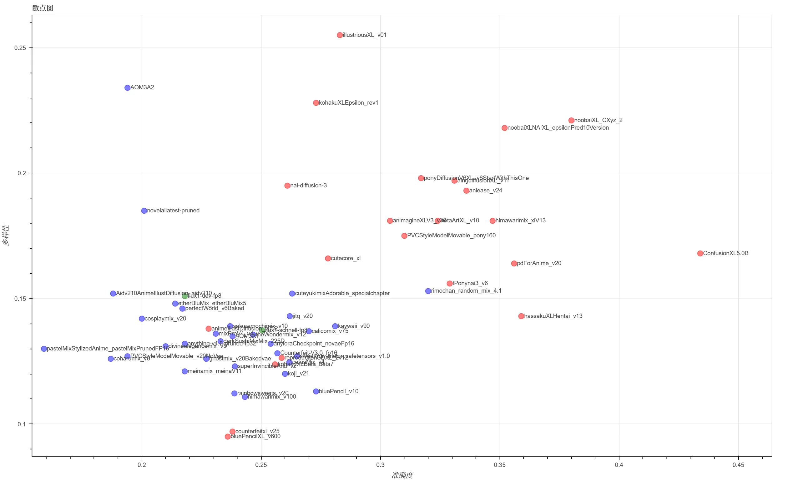
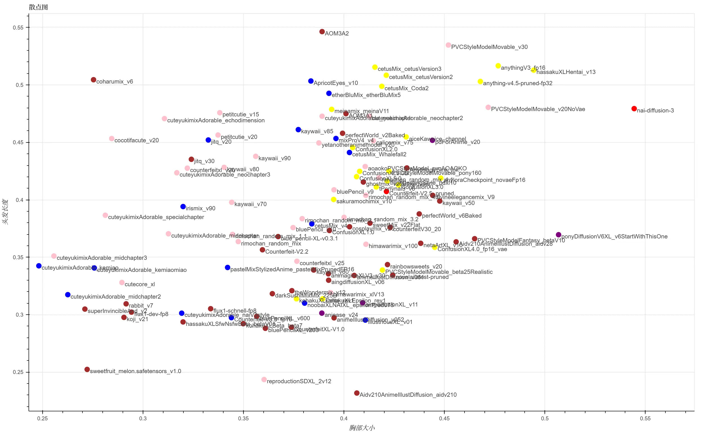

# stable diffusion 动漫标签自动化评测

大家在用stable diffusion的时候，有没有遇到过你用的模型总是不能理解你要的标签的情况？

前几天我就想试试XL模型是不是能解决这类问题。按理说模型更大了，应该更聪明1点。可是下了几个动漫的XL模型，手动测试了1下，好像不仅没有解决不理解标签的问题，还更坏了？

不过感觉毕竟是不准的，1个1个用眼睛看也看不完，不如我来发明1个测试工具，直接把各种模型×各种标签统统测试1遍，这样就知道它们到底准不准了！

## 单标签测试

第1项测试比较简单，我们来测试1下模型是否能正确地画出各种类的标签。横座标是模型的名字，纵座标是标签分类，表格的数值是准确率。

- 准确率的意思是，假如我用`AOM3A1`模型，生成了`n`张包含`人物-动作`tag的图片，即每张的prompt中包含1个随机的`人物-动作`tag，然后用ML-Danbooru检测这`n`张图片，能被预测出和prompt中相同的tag的张数为`k`，那么`AOM3A1`×`人物-动作`的准确率就是`k/n`。

- 采样方法是选择使用率最高的前1500个标签，然后用每个模型给每个标签生成16张图，再把标签分到对应的分类里。因此标签的样本数是均匀的，但是分类的样本数不是均匀的。

评测的模型是这样挑选的，在Civitai上选了比较热门的模型系列，然后从每个系列中选出几个下载量较大的模型来测试。

- 如果你有什么想试的模型也可以告诉我，我1起加进来。

完整的表格测试结果可以看[模型对标签类别-准确率.md](./测试结果/模型对标签类别-准确率.md)，样例如下:

|                          | AOM3A1   | ConfusionXL5.0B   | Counterfeit-V3.0   | anything-v4.5   | nai-diffusion-3   |
|:-------------------------|:---------|:------------------|:------------------------|:----------------------------|:------------------|
| 艺术破格                 | 0.078    | 0.334             | 0.156                   | 0.075                       | 0.188             |
| 人物-动作                | 0.504    | 0.822             | 0.549                   | 0.479                       | 0.628             |
| 人物-全身装饰            | 0.734    | 0.977             | 0.758                   | 0.594                       | 0.68              |
| 人物-胸部                | 0.497    | 0.799             | 0.458                   | 0.433                       | 0.578             |
| 人物-衣装                | 0.776    | 0.878             | 0.795                   | 0.754                       | 0.797             |
| 人物-摆位                | 0.473    | 0.768             | 0.594                   | 0.388                       | 0.54              |
| 人物-耳朵                | 0.842    | 0.929             | 0.884                   | 0.807                       | 0.842             |
| 人物-面部                | 0.409    | 0.799             | 0.508                   | 0.378                       | 0.577             |
| 人物-头发                | 0.575    | 0.891             | 0.671                   | 0.547                       | 0.681             |
| 人物-头部饰品            | 0.698    | 0.903             | 0.806                   | 0.691                       | 0.708             |
| 人物-类型                | 0.615    | 0.742             | 0.657                   | 0.587                       | 0.589             |
| 人物-下身装饰            | 0.717    | 0.879             | 0.747                   | 0.69                        | 0.736             |
| 人物-脖子                | 0.786    | 0.933             | 0.808                   | 0.768                       | 0.806             |
| 人物-鞋袜                | 0.667    | 0.881             | 0.728                   | 0.642                       | 0.755             |
| 人物-上身装饰            | 0.737    | 0.917             | 0.783                   | 0.72                        | 0.717             |
| 人文景观-建筑物     | 0.903    | 0.943             | 0.886                   | 0.886                       | 0.415             |
| 人文景观-谷制品     | 0.713    | 1.0               | 0.8                     | 0.625                       | 0.325             |
| 人文景观-饮料       | 0.781    | 0.93              | 0.812                   | 0.844                       | 0.586             |
| 人文景观-水果       | 0.889    | 0.958             | 0.889                   | 0.75                        | 0.368             |
| 人文景观-主食       | 0.725    | 1.0               | 0.8                     | 0.662                       | 0.287             |
| 人文景观-肉类与海鲜 | 0.906    | 1.0               | 0.984                   | 0.781                       | 0.453             |
| 人文景观-糖果零食   | 0.722    | 0.9               | 0.859                   | 0.681                       | 0.566             |
| 人文景观-蔬菜与香料 | 0.896    | 0.917             | 0.938                   | 0.792                       | 0.802             |
| 人文景观-室内       | 0.991    | 1.0               | 0.92                    | 0.973                       | 0.812             |
| 人文景观-室外       | 0.958    | 0.99              | 1.0                     | 0.99                        | 0.417             |
| 构图-背景                | 0.803    | 0.928             | 0.894                   | 0.793                       | 0.774             |
| 构图-打码方式            | 0.359    | 0.333             | 0.219                   | 0.12                        | 0.245             |
| 构图-色彩                | 0.285    | 0.723             | 0.66                    | 0.234                       | 0.574             |
| 构图-构图方式            | 0.292    | 0.677             | 0.339                   | 0.214                       | 0.526             |
| 构图-制图特效            | 0.467    | 0.827             | 0.776                   | 0.452                       | 0.449             |
| 构图-图片类型            | 0.318    | 0.622             | 0.367                   | 0.253                       | 0.417             |
| 构图-视角                | 0.588    | 0.838             | 0.706                   | 0.562                       | 0.632             |
| 构图-画风                | 0.192    | 0.492             | 0.283                   | 0.092                       | 0.483             |
| 物品                     | 0.804    | 0.958             | 0.878                   | 0.765                       | 0.812             |
| 自然景观-花卉            | 0.855    | 1.0               | 0.943                   | 0.835                       | 0.668             |
| 自然景观-位置-室外       | 0.927    | 0.995             | 0.995                   | 0.901                       | 0.484             |
| 自然景观-天空/气象       | 0.87     | 0.964             | 0.87                    | 0.849                       | 0.578             |
| 限制级-成年限定          | 0.508    | 0.653             | 0.365                   | 0.251                       | 0.343             |
| 限制级-限制级            | 0.597    | 0.722             | 0.58                    | 0.438                       | 0.457             |
| 总体                     | 0.604    | 0.832             | 0.657                   | 0.559                       | 0.626             |

## 多标签测试-准确度

接下来是测试模型在单张图片的标签数变多时，是会顾此失彼，还是能把这些标签都画出来。同上，横座标是模型的名字，纵座标是标签分类，表格的数值是准确率。

- 准确率的意思是，假如我用`AOM3A1`模型，生成了`n`张包含`m`个tag的图片，即每张的prompt中包含`m`个随机的tag，然后用ML-Danbooru检测这`n`张图片，每张图片中能被预测出和prompt中相同的tag的数量总和为`k`，那么`AOM3A1`×`n tags`的准确率就是`k/(n*m)`。

- 采样方法是每次从使用率最高的前1500个tag中随机抽取`m`个，然后用每个模型给这1次的`m`个tag生成16张图。

完整的表格测试结果可以看[模型对标签个数-准确率和多样性.md](./测试结果/模型对标签个数-准确率和多样性.md)，样例如下:

|    |   AOM3A1 |   ConfusionXL5.0B |   Counterfeit-V3.0 |   anything-v4.5 | nai-diffusion-3   |   noobaiXLNAIXL_epsilonPred10Version |
|---:|---------:|------------------:|------------------------:|----------------------------:|:------------------|-------------------------------------:|
|  2 |    0.488 |             0.745 |                   0.53  |                       0.445 | -                 |                                0.709 |
|  8 |    0.362 |             0.649 |                   0.414 |                       0.34  | -                 |                                0.595 |
| 32 |    0.238 |             0.434 |                   0.258 |                       0.218 | 0.261             |                                0.352 |

## 多标签测试-多样性

接下来来测试模型生成图片的多样性。横座标是模型的名字，纵座标是标签分类，表格的数值是多样性。

- 多样性的意思是，假如我用`AOM3A1`模型，在相同tag下生成了`n`张图片，将每1张图和它的后1张图过CLIP之后计算embedding的余弦相似度，`1-这些余弦相似度的平均值`即为`AOM3A1`×`n tags`的多样性。

完整的表格测试结果可以看[模型对标签个数-准确率和多样性.md](./测试结果/模型对标签个数-准确率和多样性.md)，样例如下:

|    |   AOM3A1 |   ConfusionXL5.0B |   Counterfeit-V3.0 |   anything-v4.5 | nai-diffusion-3   |   noobaiXLNAIXL_epsilonPred10Version |
|---:|---------:|------------------:|------------------------:|----------------------------:|:------------------|-------------------------------------:|
|  2 |    0.157 |             0.15  |                   0.139 |                       0.147 | -                 |                                0.206 |
|  8 |    0.148 |             0.141 |                   0.129 |                       0.135 | -                 |                                0.191 |
| 32 |    0.135 |             0.168 |                   0.127 |                       0.132 | 0.195             |                                0.218 |

画了1张图，表示当tag数量为32时，各个模型的准确度和多样性，是这样——

> 蓝色为SD1.5模型，红色为SDXL模型，绿色为Flux模型。

## 生成人物测试

这个测试是指，模型在没有LORA，仅使用人物prompts时，是否能画出对应的人物。

这里的准确率比较简单，对生成的图片使用`wd-swinv2-tagger-v3`模型检测，能检测到prompt中的人物就算+1。

测试范围是danbooru中出现次数多的人物。不过如果按全期抽样角色出现的频率，早期作品的角色就会偏多(比如东方和舰娘)，所以实际的测试范围是把近期的角色和全期的角色分别抽样后取了并集。

完整的表格测试结果可以看[模型对不同作品的准确率.md](./测试结果/模型对不同作品的准确率.md)，样例如下:

|          | AOM3A1   | ConfusionXL5.0B   | Counterfeit-V3.0   | anything-v4.5   | nai-diffusion-3   | noobaiXLNAIXL_epsilonPred10Version   |
|:---------|:---------|:------------------|:------------------------|:----------------------------|:------------------|:-------------------------------------|
| 蔚蓝档案 | 0/17     | 16/17             | 0/17                    | 0/17                        | 15/17             | 16/17                                |
| fate     | 4/11     | 10/11             | 4/11                    | 3/11                        | 10/11             | 10/11                                |
| 原神     | 6/13     | 13/13             | 6/13                    | 5/13                        | 13/13             | 13/13                                |
| hololive | 0/18     | 16/18             | 1/18                    | 0/18                        | 14/18             | 16/18                                |
| 偶像大师 | 1/9      | 2/9               | 2/9                     | 1/9                         | 8/9               | 8/9                                  |
| 舰娘     | 16/31    | 1/31              | 16/31                   | 12/31                       | 30/31             | 30/31                                |
| 东方     | 27/52    | 16/52             | 33/52                   | 22/52                       | 50/52             | 51/52                                |
| 总体     | 75/221   | 128/221           | 90/221                  | 63/221                      | 194/221           | 212/221                              |

## 属性偏好测试

顺便测了1下，模型在没有收到特定的prompt时，会倾向于生成什么样的角色。

数据是将「单标签测试」的模型预测结果中每张图片的标签统计之后的结果。因为这个是搞笑的，所以就不解释计算规则了。画了一张图，是这样——

圆形的颜色代表的是，在生成的图片中出现次数最多的头发颜色标签。

## 画风测试

画风量化起来不是很方便。不过好在这个东西用眼睛看也不难，所以用相同的prompt为每个模型生成了几张样例图片。

我先放1个「街上的双马尾JK」在这里，其他的样例大家可以到[img](./img)文件夹里面看。

## 使用方法

- 首先你要有1个[stable-diffusion-webui](https://github.com/AUTOMATIC1111/stable-diffusion-webui)。运行`webui-user.bat`，启动参数需要加上`--api`。

- 安装依赖: `pip install -r requirements.txt`。

- 运行评测代码: `python 评测单标签.py`或`python 评测多标签.py`。会生成`记录.json`或`记录_多标签.json`文件，包含1个巨大的list。

- 导出表格: `python 导出表格.py`。会读取记录文件，生成`好.md`文件，里面就是以表格形式打出的指标了。

## 结束

顺便说1下，标签目录是从<https://github.com/wfjsw/danbooru-diffusion-prompt-builder>扣出来的，但是因为我是傲娇所以不会感谢她！

就这样，大家88，我要回去和GPT亲热了！
